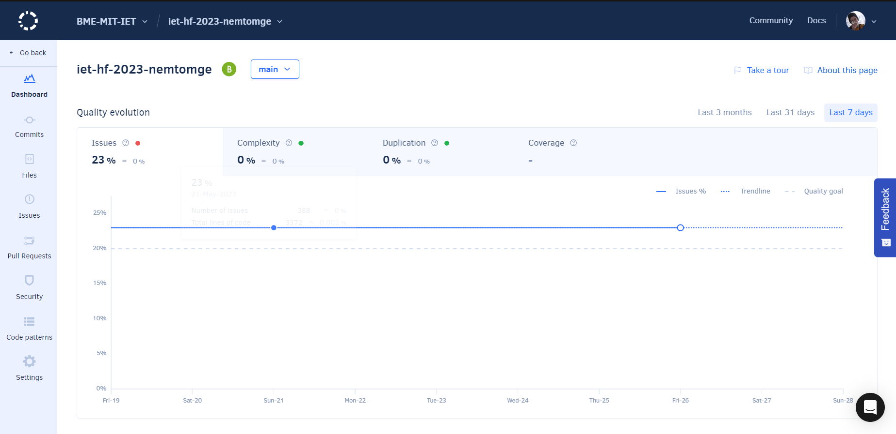
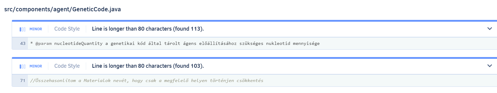

# 2 - Manual code-review and static analysis

My task was to make a manual code-review and to add the project to a static analysis tool

### Static analysis 

First I added the project to an analysis tool called [Codacy](https://www.codacy.com)

Here we can see that after running the analysis, the project got B grade due to the number of the issues.

It' ve found 388 issues in the project, but most of them were minor. 
The most common issue was that the comments are too long. I couldn't find the way to edit the threshold for the comment lenghts.